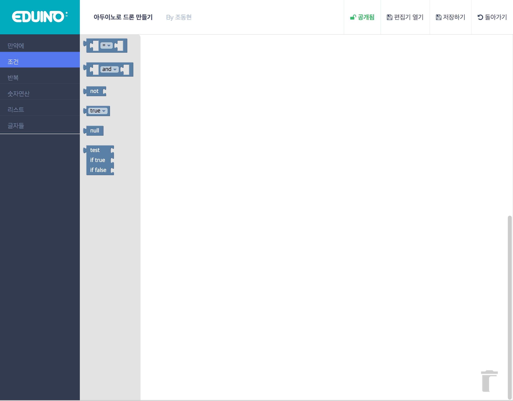

# Eduino
Eduino - The Online Web Arduino IDE

### Welcome to Eduino

Eduino is a web based Arduino IDE.

Eudino is based on google-blockly(https://github.com/google/blockly) open source.

There are two editors in Eduino

* Block coding editors

* Code editors

### Features 

> DONE 

* Online Storage
* Web Server (by node.js, express)

> TODO

* Arduino Upload

* Arduino Serial Monitoring

* Sensor Data Saving & Analyzing

### Developers And Contributors

* ParkJaesung
 * Korea Digital Media High School
 
 * Email : jspark141515@gmail.com
 
* Kim Dongwoo
 * Korea Digital Media High School
 * Email : andandend2847@gmail.com

* Cho Donghyun
 * Korea Digital Media High School
 * Email : cdhnet98@gmail.com

###Develop Guide

#### Save Blockly workspace and load

~~~
//save as xml
var xml_text = Blockly.Xml.domToText(xml);

//load xml to workspace
var xml = Blockly.Xml.textToDom(xml_text);
Blockly.Xml.domToWorkspace(xml, workspace);

~~~

